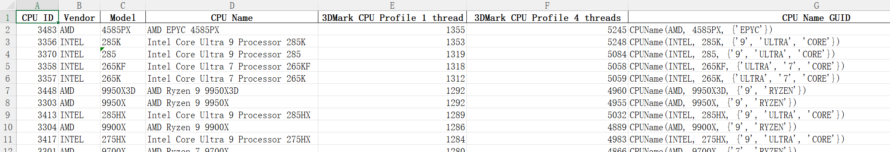

# 3DMark跑分爬取工具

## 用法
<details>
  <summary>版本要求</summary>

- Python >= 3.9
- 依赖
  - openpyxl
  - pandas
  - questionary
  - requests
  - tenacity
  - tqdm

</details>

```python
git clone https://github.com/onlynovice/3DMarkScoreScraper.git
python Main.py
```

## 说明
获取3DMark跑分数据，可以获取显卡/CPU的多种测试场景下的平均跑分。
- CPU数据来源：
    - 3DMark CPU Profile 1~16/Max Threads
- GPU数据来源：
    - 3DMark Time Spy
    - 3DMark Time Spy Extreme
    - 3DMark Port Royal
    - 3DMark Speed Way
    - 3DMark Steel Nomad DX12
    - 3DMark Steel Nomad Vulkan
    - 3DMark Steel Nomad Light DX12
    - 3DMark Steel Nomad Light Vulkan
    - 3DMark Solar Bay
    - 3DMark Fire Strike
    - 3DMark Fire Strike Extreme
    - 3DMark Fire Strike Ultra
    - 3DMark Fire Wild Life
    - 3DMark Fire Wild Life Extreme
    - 3DMark Night Raid

[3DMark Search](https://www.3dmark.com/search?#advanced?test=spy%20P&cpuId=&gpuId=1509&gpuCount=1&gpuType=ALL&deviceType=ALL&storageModel=ALL&showRamDisks=false&memoryChannels=0&country=&scoreType=graphicsScore&hofMode=true&showInvalidResults=false&freeParams=&minGpuCoreClock=&maxGpuCoreClock=&minGpuMemClock=&maxGpuMemClock=&minCpuClock=&maxCpuClock=)

有两种工作模式
1. 全量更新，从3dmark爬取数据，保存到本地（json格式），然后处理数据导出Excel
2. 从本地读取json数据，处理数据导出Excel




